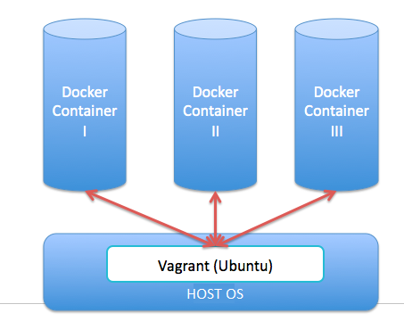
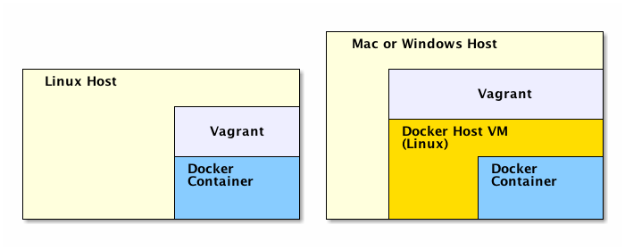
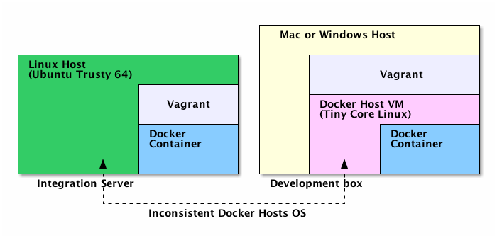
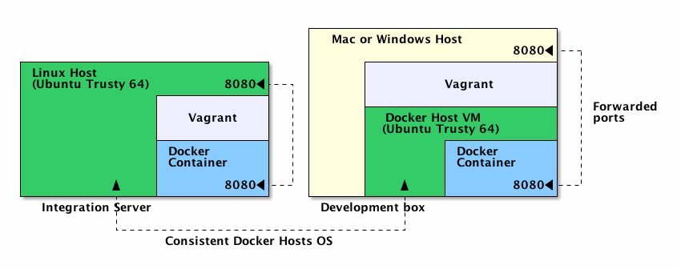

# Setting up an automated local development environment using Docker and Vagrant

# Problem Statement
We need a way to build isolated and repeatable production like development environments on local machine.


# Possible Solutions
Classic VMs ensure isolated and repeatable environments. But these are resource consuming. Developers need to code/build/test every few minutes and won't accept the virtualization overhead. So instead of make OS level containers (i.e., VMs), using application level containers is extremely fast and easier to maintainer. For this we use docker application containers and vagrant automation to provide the desired OS for docker container to run in isolation - 

Feature | Options
------- | -------
Application Container | [Docker](https://www.docker.com/)
Base OS Provider | [Vagrant](https://www.vagrantup.com/)


# Solution Evaluations

 

_NOTE: Image Source [docker-dev-in-box-environment](http://itsmyviewofthings.blogspot.com/2014/06/docker-dev-in-box-environment-setup.html)_

In this experiment, we write code for setting up the base infrastructure on local developer machine, a.k.a., Infrastructure as code (IaC). The project on which this experiment is done - [github.com/airavata-courses/spring17-API-Server](https://github.com/airavata-courses/spring17-API-Server) - a microservice. For building Infrastructure as code the additional files created are  "Dockerfile" for each microservice, and one "Vagrantfile" as provider automation script. For any project this is a one time effort. After that building production like environment on local machine is fast and easy. So it can save a lot time and effort compared to doing the same activity manually.

### Docker
Dockerfiles are really straightforward and there is an excellent [online reference manual](https://docs.docker.com/engine/reference/builder/). You can directly run a docker container from the command like this - 
```docker build -t=myDockerImageName .```

And you can run a docker-image as container like this -
```docker run -a stdin -a stdout -i -t myDockerImageName /bin/bash```


 

_NOTE: Image Source [running-docker-directly](http://blog.zenika.com/2014/10/07/setting-up-a-development-environment-using-docker-and-vagrant/)_

By default, on Windows or Mac machine, these containers run on top of [boot2docker](https://github.com/boot2docker/boot2docker) docker-machine by docker installation. On linux, docker directly leverages the virtualization from the host machine kernel. The docker container (i.e., running images) consumes few MBs of memories as compared to running a VM which consumes memory in GBs. On Windows or Mac machine, in order to run docker-containers, on custom linux flavor, Vagrant VM automation tool is useful which is explained below.  

### Vagrant

Vagrant is just a Docker wrapper on systems that support Docker natively while it spins up a host VM to run containers on systems that don't support it. Users don't have to bother whether Docker is supported natively or not : the same configuration will work on every OS. Vagrant can orchestrate Docker containers: run multiple containers concurrently and link them together. Docker hosts are not limited to boot2docker (a Virtualbox image of Tiny Core Linux) but Debian, Ubuntu, CoreOS and other Linux distros are supported too. And can run on more stable VM managers than Virtualbox (e.g. VMWare).

 

_NOTE: Image Source [docker-provider-for-vagrant](http://blog.zenika.com/2014/10/07/setting-up-a-development-environment-using-docker-and-vagrant/)_

The basic usage of vagrant with docker as the provider, brings the same situation (see above). That is, on platforms that don't support containers, by default Vagrant spins up a Tiny Core Linux (boot2docker) Docker host. 

If our production environment is running some other linux (say ubuntu 14.04 LTS) we have a gap between the configurations of development and production environments. In some cases, this can virtually be the cause of a production bug, impossible to identify in development environment. 

 

_NOTE: Image Source [docker-provider-for-vagrant](http://blog.zenika.com/2014/10/07/setting-up-a-development-environment-using-docker-and-vagrant/)_

So, one of Vagrant main conveniences is that it let us specify a custom Docker host and we are not stuck with boot2docker VM (see above). For this the main ```Vagrantfile``` references to another vagrantfile (say ```DockerHostVagrantfile```) like this - 

```
	...
	# other "docker provider" specific configuration
	...
	
	d.vagrant_vagrantfile = "./DockerHostVagrantfile"
	
``` 

Where [DockerHostVagrantfile](https://github.com/airavata-courses/spring17-devops/blob/feature-iac-dev-env/infrastructure/api-server/terraform/dev-env/DockerHostVagrantfile) will override the docker-provider specific default configurations. And you replace boot2docker with production environment VM (say ubuntu 14.04 LTS). Using Vagrant to control Docker containers can be useful if dealing with a mix of different platforms: some Docker-enabled and others not. In this scenario using Vagrant makes the process of setting up an environment consistent across different platforms.


# Conclusion
Writing Dockerfile and Vagrantfile requires initial effort. But the over all gains are considerable for long term. Infrastructure as Code provides the fastest and most resource-effective way of building isolated and repeatable environments. Since containers are isolated instances that run your applications. These lightweight instances can be replaced, rebuilt, and moved around easily. This allows us to mirror the production and development environment and is a tremendous help in the continuous integration and delivery process.

  
# Associated Issue(s) on GitHub
- [IAC: [POC] Setting up a development environment](https://github.com/airavata-courses/spring17-devops/issues/6)


# Associated Code(s) on GitHub
[github.com/airavata-courses/spring17-devops/tree/feature-iac-dev-env/infrastructure/api-server/terraform/dev-env](https://github.com/airavata-courses/spring17-devops/tree/feature-iac-dev-env/infrastructure/api-server/terraform/dev-env)


# References Used for Experiment(s)
- [development-environment-using-docker-and-vagrant](http://blog.zenika.com/2014/10/07/setting-up-a-development-environment-using-docker-and-vagrant/)

- [docker-dev-in-box-environment-setup](http://itsmyviewofthings.blogspot.com/2014/06/docker-dev-in-box-environment-setup.html)

- [dockerfile-syntax-reference](https://docs.docker.com/engine/reference/builder/)

- [vagrant-docker-provider](https://www.vagrantup.com/docs/docker/)

