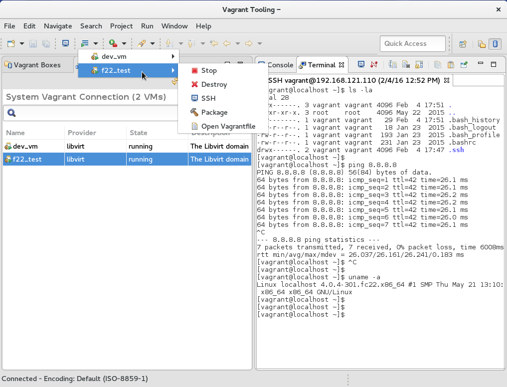
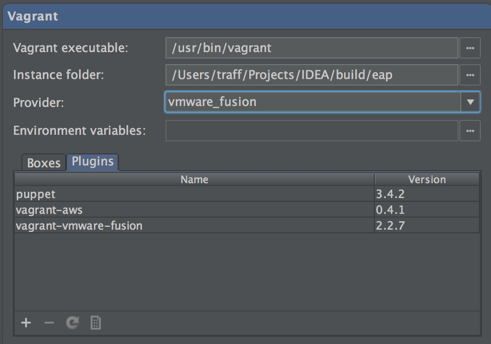
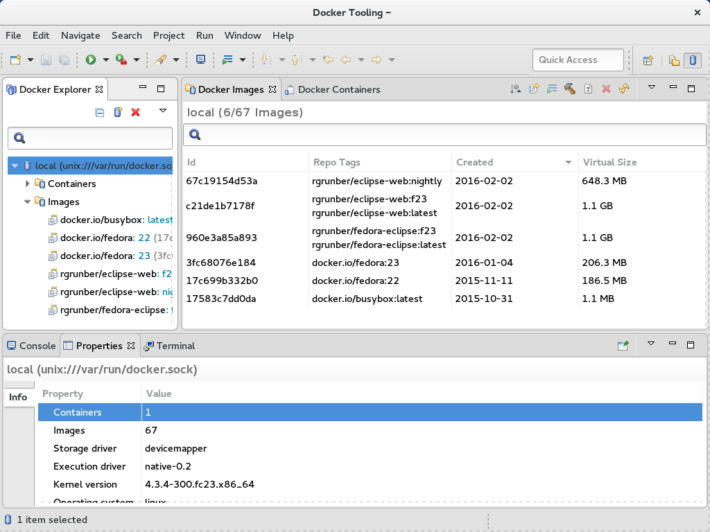
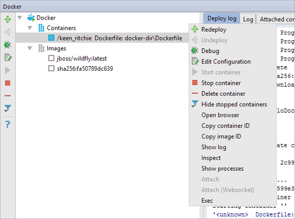
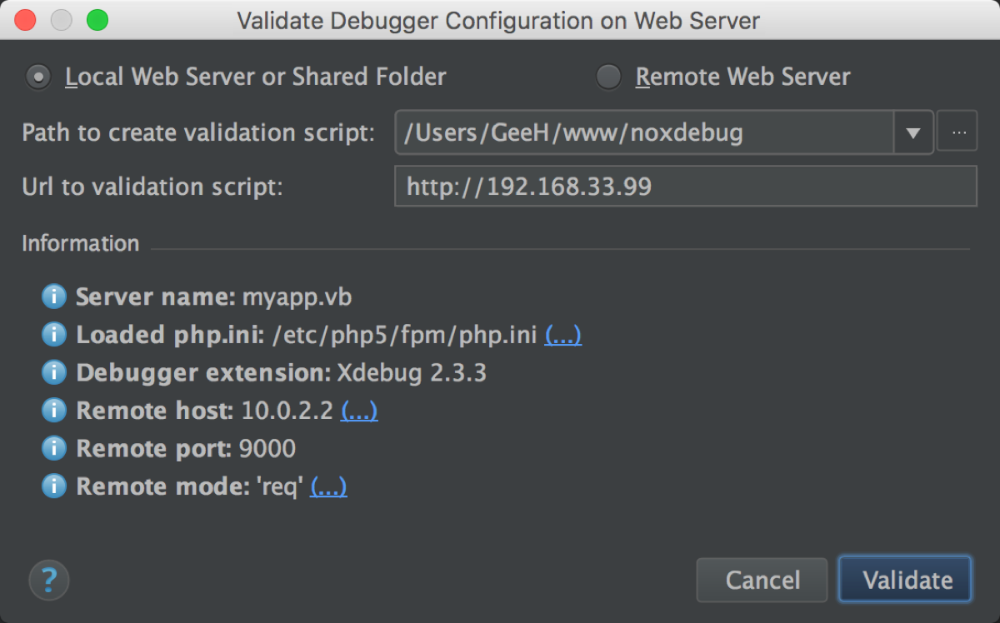

# DevOps for Apache Airavata

# Problem Statement
In [previous work](./docker-and-vagrant-with-IDE.md), IDE Integration of Docker and Vagrant tools were explored. In the final report, there are three ways of Local Provisioning for development & Testing suggested -
-	Run Ansible Playbooks on top of Vagrant Box
-	Run Ansible Playbooks on top of Docker Container
-	Dockerizing Airavata Microservices

For these three approaches, new tools like Vagrant and Docker are heavily used. Explore and suggest best practices of Vagrant and Docker Development in IDE. And explore and suggest best practices of Debugging deployed code base in Vagrant box and Docker container.

# Possible Solutions
For Vagrant development in IDE following tool is considered -

Feature | Options
------- | -------
Eclipse IDE | [Eclipse Vagrant Tooling](https://marketplace.eclipse.org/content/eclipse-vagrant-tooling)
IntelliJ Idea IDE | [Jetbrains Vagrant Plugin](https://plugins.jetbrains.com/plugin/7379-vagrant)

For Docker Development in IDE following tool is considered -

Feature | Options
------- | -------
Eclipse IDE | [Eclipse Docker Tooling](https://marketplace.eclipse.org/content/eclipse-docker-tooling)
IntelliJ Idea IDE | [Jetbrains Docker Integration](https://plugins.jetbrains.com/plugin/7724-docker-integration)

For debugging deployed code base in Vagrant box following approach is considered - 

- [Vagrant Synced folders](https://www.vagrantup.com/docs/synced-folders/) for centralized application logs on Host Machine
- [Vagrant SSH](https://www.vagrantup.com/intro/getting-started/up.html) to inspect application process in Guest Machine

For debugging deployed code base in Docker Container following approach is considered -
- Logging via the Application
- Logging via Data Volumes 
- Logging via the Docker Logging Driver 
- Logging via a Dedicated Logging Container
- Sidecar Approach


# Solution Evaluations

### For Vagrant development in IDE

###### Eclipse Plugin - Eclipse Vagrant Tooling


_Source Image: [marketplace.eclipse.org/.../eclipse-vagrant-tooling](https://marketplace.eclipse.org/content/eclipse-vagrant-tooling#group-screenshots)_


###### IntelliJ Idea Plugin - Jetbrains Vagrant Plugin



_Source Image: [plugins.jetbrains.com/plugin/7379-vagrant](https://plugins.jetbrains.com/plugin/7379-vagrant)_


### For Docker Development in IDE

###### Eclipse Plugin - Eclipse Docker Tooling


_Source Image: [marketplace.eclipse.org/.../eclipse-docker-tooling](https://marketplace.eclipse.org/content/eclipse-docker-tooling#group-screenshots)_


###### IntelliJ Idea Plugin - Jetbrains Docker Integration



_Source Image: [plugins.jetbrains.com/plugin/7724-docker-integration](https://plugins.jetbrains.com/plugin/7724-docker-integration)_

### For debugging deployed code base in Vagrant box

- ```Remote Debugging```: Attach your IDE's debugger to a running process which is inside the vagrant box. For this port-forwarding configuration should be enabled. A typical configuration would look like this -



_Image Source: [confluence.jetbrains.com/.../Configuring+a+Vagrant+VM+for+Debugging](https://confluence.jetbrains.com/display/PhpStorm/Configuring+a+Vagrant+VM+for+Debugging)_

- ```Vagrant Synced folders```: Set up shared folders in vagrantfile like this 

	```
	config.vm.synced_folder "/home/dev-user/my-box/application-1/logs", "/var/log/application-1/", disabled: false, create: true
	config.vm.synced_folder "/home/dev-user/my-box/application-2/logs", "/var/log/application-2/", disabled: false, create: true
	config.vm.synced_folder "/home/dev-user/my-box/application-3/logs", "/var/log/application-3/", disabled: false, create: true
	```

	This shared folder is a centralized persistent space on disk available for read from the host machine.
	
- ```Vagrant SSH```: Login to vagrant box in order to inspect processes manually.


- ```debugging output from Ansible and Vagrant```: get additional debug information about locally running Ansible playbooks when provisioned via Vagrant like [this](https://serverfault.com/a/611070) - 

	```
	config.vm.provision "ansible" do |ansible|
    	ansible.verbose = "vvv"
	end
	```
	
	This sets the verbose option of ansible:

	```
	-v, --verbose         verbose mode (-vvv for more, -vvvv to enable
                        connection debugging)
	```


### For debugging deployed code base in Docker Container
- ```Logging via the Application```:

- ```Logging via Data Volumes```:

- ```Logging via the Docker Logging Driver```: 

- ```Logging via a Dedicated Logging Container```:

- ```Sidecar Approach```:


# Conclusion

In short term, we recommend ```Ansible Playbooks on top of Vagrant Box```, and for this the Vagrant IDE plugin and shared directory based debugging practices suits best. This is a minimal effort solution, fits well in the current development life cycle of Airavata and easier to set up.

In long term, if Airavata is to be built ground up using Docker containers, we recommend ```Dockerizing Airavata Microservices```, and for this Docker IDE plugin and one of five different ways of debugging options are available depending on how production architecture of logging mechanism is setup. This is a good solution, with larger long term benefits in terms of saving resource consumption and time, but this will need some initial time investment in order to dockerize/ containerize all Airavata microservices.

# Associated Discussion(s)
- [[Debugging applications with Docker Containers] Setting up an automated production like local development environment (part-4)](https://lists.apache.org/)

- [[Debugging applications with Vagrant Boxes] Setting up an automated production like local development environment (part-3)](https://lists.apache.org/)

- [[IDE Integration] Setting up an automated production like local development environment (part-2)](https://lists.apache.org/thread.html/52c10855b6b11d53fa2bca9003c39779d4522d4f7386954179ac41b4@%3Cdev.airavata.apache.org%3E)


# Associated Issue(s) on GitHub
- [IAC: devops for airavata environment](https://github.com/airavata-courses/spring17-devops/issues/7)


# Associated Code(s) on GitHub
- [github.com/.../Vagrantfile]() by [Anuj](https://github.com/anujbhan)

- [github.com/.../airavata-ansible/.../local_airavata_deploy.yml]() by [Anuj](https://github.com/anujbhan)

- [github.com/.../airavata-docker/.../Dockerfiles](https://github.com/ajinkya-dhamnaskar/airavata/tree/airavata-docker/dev-tools/docker) by [Ajinkya](https://github.com/ajinkya-dhamnaskar)


# References used for study
[For Vagrant development in IDE]
- Eclipse IDE | [Eclipse Vagrant Tooling](https://marketplace.eclipse.org/content/eclipse-vagrant-tooling)
- IntelliJ Idea IDE | [Jetbrains Vagrant Plugin](https://plugins.jetbrains.com/plugin/7379-vagrant)

[For Docker Development in IDE]
- Eclipse IDE | [Eclipse Docker Tooling](https://marketplace.eclipse.org/content/eclipse-docker-tooling)
- IntelliJ Idea IDE | [Jetbrains Docker Integration](https://plugins.jetbrains.com/plugin/7724-docker-integration)


[For debugging deployed code base in Vagrant box]
- [Enable additional debugging output from Ansible and Vagrant?](https://serverfault.com/a/611070)

- [debug code on a remote server (or in vagrant box)](https://www.dev-metal.com/debug-code-remote-server-vagrant-box-phpstorm/)

- [Debugging a Web-app in a Vagrant-provisioned VirtualBox VM](http://www.papayasoft.com/2013/02/25/debugging-vagrant-virtualbox-vm-netbeans/)

- [intellij-support.jetbrains: Debugging on Vagrant](https://intellij-support.jetbrains.com/hc/en-us/community/posts/206595125-Debugging-on-Vagrant)

- [Getting the remote debugger to work with a java process running in a vagrant vm](https://gist.github.com/happysundar/8704161)

- [confluence.jetbrains: Configuring a Vagrant VM for Debugging](https://confluence.jetbrains.com/display/PhpStorm/Configuring+a+Vagrant+VM+for+Debugging)

[For debugging deployed code base in Docker Container]
- [Docker Logs - Docker Logging drivers](https://docs.docker.com/engine/reference/commandline/logs/)

- [5 Methods of Logging in Docker](https://www.loggly.com/blog/top-5-docker-logging-methods-to-fit-your-container-deployment-strategy/)

- [Docker Logging Strategies](https://www.loggly.com/docs/strategies-for-docker-logging/)
