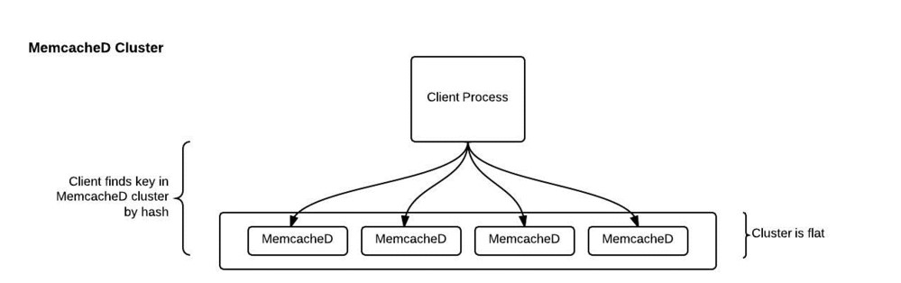
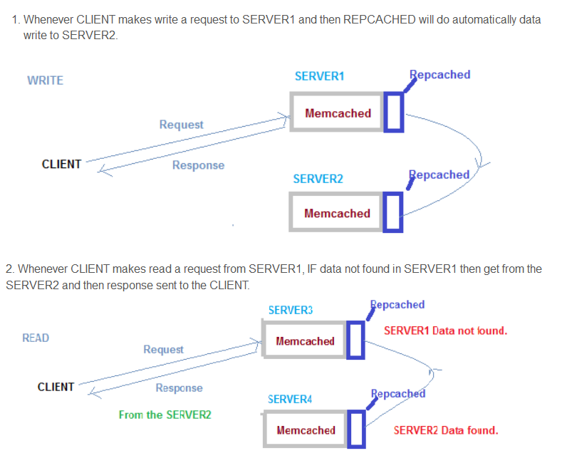
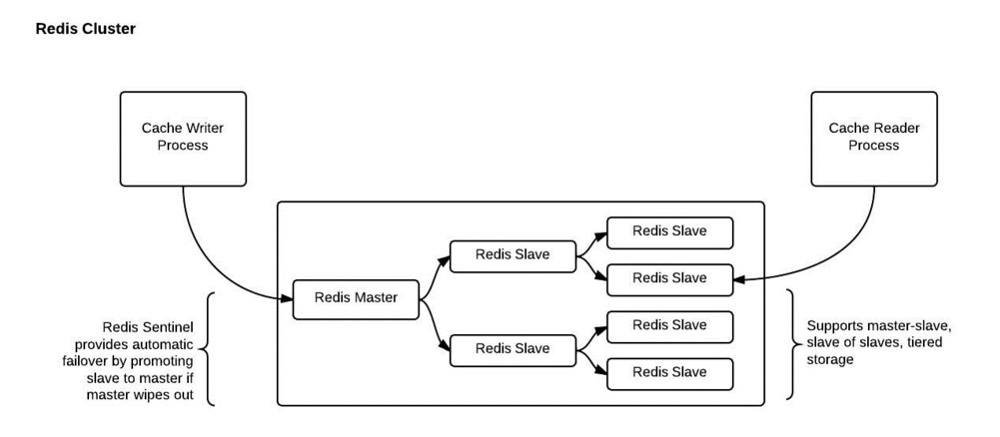

# Distributed Caching for Airavata Gateway

# Problem Statement
We need a way to provide single logical view (and state) for session and security management using caching for the web applications.

# Possible Solutions
In order to maintain single state of app data and web session data the approach of utilizing distributed cache system is preferred. It is an extension of the traditional concept of cache used on a single machine. 

A distributed cache system should be able to - 
- Scale horizontally across multiple servers.
- Scale across multiple regions (WANs).
- Provide high availability
- Provide Fault Tolerant, fail-over cluster
- Perform faster/ concurrent read & writes
- Provide data persistence, in the event of power failure
- Install, configure and deploy with less complexity
- Work well will popular technologies, like PhP, C++. Python, JAVA based frameworks

There are two very popular distributed cached systems available which are heavily used in production environment - 

Feature | Options
------- | -------
Distributed Cache | [Memcached](https://memcached.org/), [Redis](https://redis.io/)

# Solution Evaluations
## Memcached
Memcached is an in-memory key-value store for small chunks of arbitrary data (strings, objects) from results of database calls, API calls, or page rendering. It is free & open source, high-performance, distributed memory object caching system, generic in nature, but intended for use in speeding up dynamic web applications by alleviating database load.

It is a standalone server and web-applications has to know in advance how many Memcached servers are installed. If there are 10 Memcached Servers, the web-application is configured to use these 10 servers as hash buckets for storing <key, value> pairs. 



_Note: Image from [Source](http://www.bigdatalittlegeek.com/blog/2014/3/25/memcached-vs-redis)_

```Memcached Pros```
- Low complexity, Simple to configure, Simple to cluster
- Atomic increments and decrements
- Scales horizontally across multiple servers.
- Works well will popular technologies, like PhP, C++. Python, JAVA based frameworks
- Provides high availability when used with [repcached](http://repcached.lab.klab.org/)
- Provides fault tolerant, fail-over cluster  when used with [repcached](http://repcached.lab.klab.org/)

<br>



_Note: Image from [Source](https://sourceforge.net/p/repcached/discussion/749744/thread/b8d571aa/?limit=50)_

```Memcached Cons```
- Caches sharded by client do not scale across AWS zones (WANs)
- Unbalanced memcached clusters require a full system restart
- Adding a member to the pool requires reconfiguring and rebooting the client
- No data persistence, in the event of power failure

  
## Redis
It is an open source, in-memory data structure store, used as a database, cache and message broker. It supports data structures such as strings, hashes, lists, sets, sorted sets with range queries, bitmaps, hyperloglogs and geospatial indexes with radius queries. Redis has built-in replication, Lua scripting, LRU eviction, transactions and different levels of on-disk persistence, and provides high availability via Redis Sentinel and automatic partitioning with Redis Cluster.

It has Master-Slave architecture. Slaves are replica of their master. All write requests are redirected to Master Server. A separate server, known as [Sentinel](https://redis.io/topics/sentinel), manages Automatic election of Master Server when primary master fails. All data from Master is replicated to child nodes. All reads requests are distributed across all the replication-nodes in a redis cluster.



_Note: Image from [Source](http://www.bigdatalittlegeek.com/blog/2014/3/25/memcached-vs-redis)_

```Redis Pros```
- Scale horizontally across multiple servers.
- Scale across multiple regions (WANs).
- Provide high availability
- Provide Fault Tolerant, fail-over cluster
- Can store data in a variety of data structures: list, array, sets and sorted sets. This means using redis APIs, a specific attribute of an object can be modified directly in the cache rather requesting full refresh of the object inside the redis cache. This brings over all efficiency for larger objects.
- Pipelining Multiple commands at once - speeds up over all execution time.
- Blocking reads -- will sit and wait until another process writes data to the cache
- Mass insertion of data to prime a cache
- Partitions data across multiple redis master-instances
- Can back data to disk. Provide data persistence, in the event of power failure.
- Work well will popular technologies, like PhP, C++. Python, JAVA based frameworks

```Redis Cons```
- Can be complex to configure -- requires consideration of data size to configure well.
- Requires Redis server administration for monitoring, partitioning and balancing.
- Sentinel is still a single point of failure. If the master wipes out, and Sentinel doesn't work, the system is out!


# Conclusion
We've tried both Memcached and Redis. It is realized Redis system is a better choice for large scale and high traffic web apps. Redis has wide selection of data structures to store desired data. This brings efficiency boost for specific application scenarios where you do not require to wrap and unwrap objects in cache. It also provides in-built support for high availability, fail over, and persistance. There are other side benefits of using redis like - Redis allows key names and values to be as large as 512MB each as compared to Memcached's limits of 250 bytes. On the other side, if the web application is meant to be simple and requires quick implementation, using Memcached (with Repcached) is reasonable choice and works best for a situation where infrastructure cost and time investment is critical.

  
# Associated GitHub issue(s)
- [Distributed Caching for Laravel portal](https://github.com/airavata-courses/spring17-laravel-portal/issues/5)


# Associated Discussion(s)
[[#Spring17-Airavata-Courses] : Distributed Caching for Airavata Gateway](https://lists.apache.org/thread.html/626e788b239d12b20858297e495f4f64e2e00751890197544de9f3c6@%3Cdev.airavata.apache.org%3E)


# References Used for Experiment(s)
- [laradock](https://github.com/laradock/laradock)
- [laravel-dockerized](https://github.com/francescomalatesta/laravel-dockerized)
- [eboraas/laravel](https://hub.docker.com/r/eboraas/laravel/)
- [PGA-Installation](http://airavata.readthedocs.io/en/latest/PGA-Installation/)