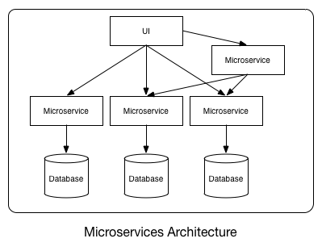
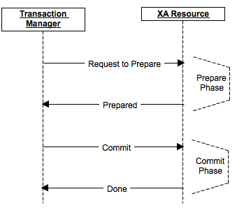
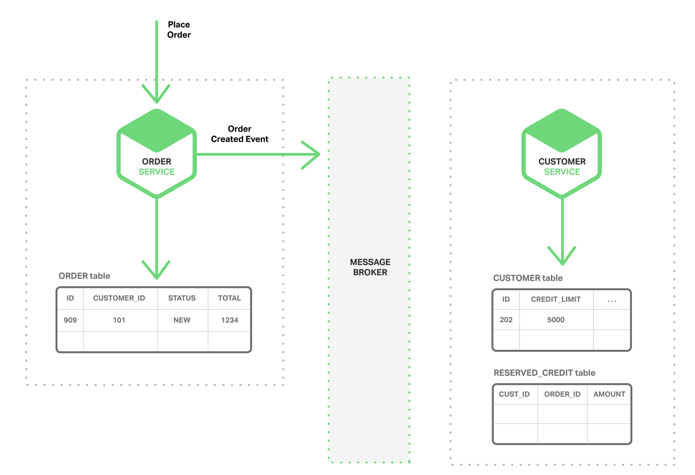
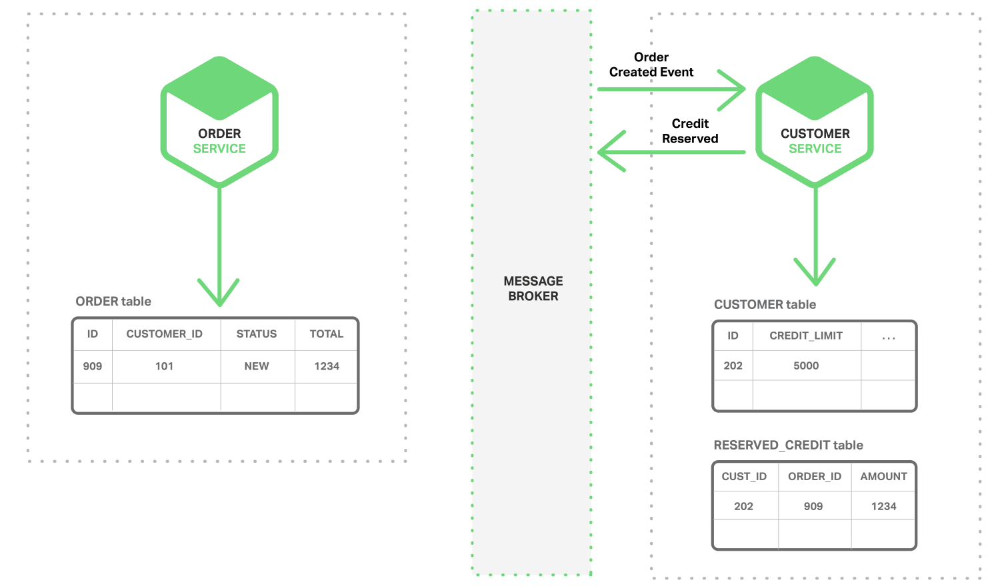
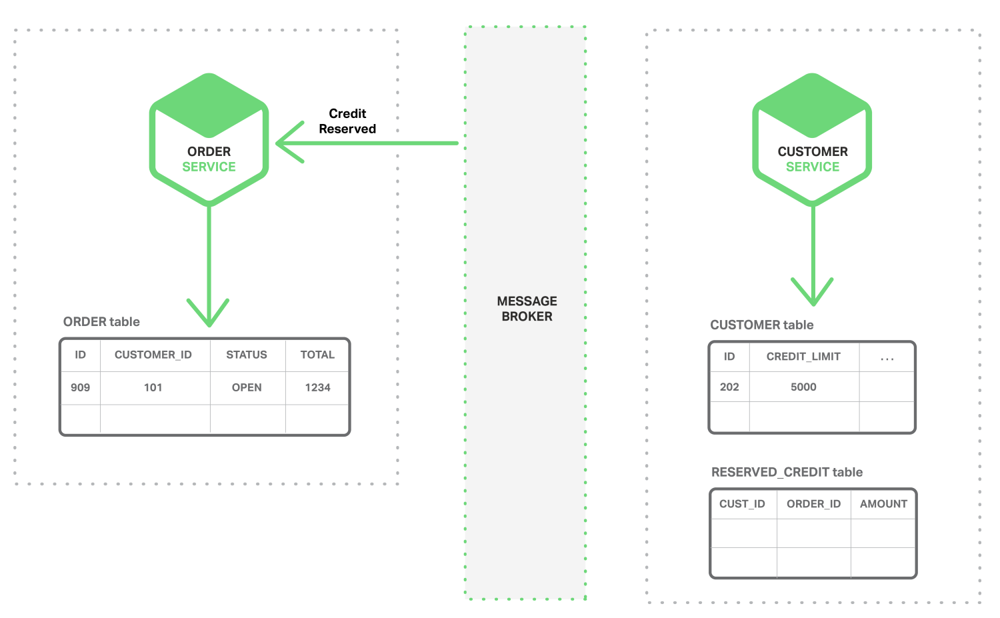

# Does each Microservices really need its own DB?



# Problem Statement
In a complex distributed cloud application (example: amazon.com ecommerce), there are many Microservices running. Each of these Microservices require storing data to a database. In a distributed application, data is stored across multiple machines (Partition tolerant from CAP theorem). In order to keep up with the high amount of user transactions, there has to be a persistent storage system which can handle fast concurrent read/ writes and still has the consistent database.

# Possible Solutions

There are two approaches which can gracefully handle this problem -
-	Common database with ```Two Phase Commit Protocol```: follows immediate consistency and not always available
-	Separate databases with ```Event Driven data replication```: follows high availability and eventual consistency

Each of these approaches has its own pros and cons which are discussed below.


# Solution Evaluations

### Approach 1: Common database with Two Phase Commit Protocol

The 2 phase commit protocol is also called XA (eXtended Architecture) transactions. This protocol provides ACID-like properties for global transaction processing. It consists of two phases - the first one is commit-request phase in which transaction manager coordinates all of the transaction resources to commit or abort. In the commit-phase, transaction manager decides to finalize operation by committing or aborting according to the votes of the each transaction resource.

```## Working of 2 phase commit protocol ##```

XA transactions need a global transaction id and local transaction id(xid) for each XA resource. Each XA Resource is enlisted to XA Manager by start(xid) method. This method tells that XA Resource is being involved in the transaction(be ready for operations).



_Source Image [xa-transactions-2-phase-commit](https://dzone.com/articles/xa-transactions-2-phase-commit)_

- Phase 1: The first phase of the 2PC protocol is realized by calling prepare(xid) method. This method requests OK or ABORT vote from XA Resource.

- Phase 2: After receiving vote from each of XA Resource, XA Manager decides to execute a commit(xid) operation if all XA Resources send OK or decides to execute a rollback(xid) if an XA Resource sends ABORT.

- Finally, the end(xid) method is called for each of XA Resource telling that the transaction is completed.


###### Pros
-	Immediate consistency

###### Cons
-	Not always available because it is a blocking protocol. A node will block while it is waiting for a message. This means that other processes competing for resource locks held by the blocked processes will have to wait for the locks to be released. A single node will continue to wait even if all other sites have failed. 

-	If the coordinator fails permanently, some cohorts will never resolve their transactions. This has the effect that resources are tied up forever.

-	The protocol is biased to the abort case rather than the complete case.


### Approach 2: Separate databases with Event Driven data replication

This is an event-driven, eventually consistent approach. Each Microservice has its own database. Each Microservice publishes an event whenever it update its data. Other Microservices subscribe to events. When an event is received, a Microservice updates its data.

Below are the sequence of diagrams that shows how one can use an event-driven approach to checking for available credit when creating an order. The Microservices exchange events via a Message Broker (Example: RabbitMQ or Kafka).




_Source Image [Event driven data management microservices](https://www.nginx.com/blog/event-driven-data-management-microservices/)_

- The Order Service creates an Order with status NEW and publishes an Order Created event.




_Source Image [Event driven data management microservices](https://www.nginx.com/blog/event-driven-data-management-microservices/)_

- The Customer Service consumes the Order Created event, reserves credit for the order, and publishes a Credit Reserved event.




_Source Image [Event driven data management microservices](https://www.nginx.com/blog/event-driven-data-management-microservices/)_

- The Order Service consumes the Credit Reserved event, and changes the status of the order to OPEN.


###### Pros
-	Highly available sub-systems.
-	Improves fault isolation: larger applications can remain largely unaffected by the failure of a single module.
-	For each service you choose the type of database that is best suited to that service’s requirements. For example, a service that does text searches could use ElasticSearch. A service that manipulates a social graph could use Neo4j. It might not make sense to use a relational database for every service.
-	Each microservice is simple to manage and it can be managed independently. Makes it easier for a new developer to understand the functionality of a service.
-	This type of architecture can handle more concurrent distributed transactions. Hence, greatly increases the scale and speed of sub systems, and the overall robustness and responsiveness of whole distributed application.


###### Cons
In a microservices architecture, each microservice has its own private datastore. Different microservices might use different SQL and NoSQL databases. While this database architecture has significant benefits, it creates some distributed data management challenges –
-	How to implement business transactions that maintain consistency across multiple services. 
-	How to implement queries that retrieve data from multiple services.
-	Another challenge with implementing an event driven architecture is how to atomically update state and how to publish events.
-	This brings eventual consistency and time take by a distributed transaction to commit 100% will vary (Example – successfully placing an order on an ecommerce website).

# Conclusion
I studied existing implementations and discussions for both approaches. And it is realized if an application is designed to be built as microservices then it is implied it is meant to be scalable and highly responsive. And there exists many open source tools and databases which can help reduce the cost of development where each microservice uses its own database. The later approach is a good solution which offers more agility and velocity to a distributed application. Because of the blocking nature of the two phase commit protocol, the former approach is not well suited for high traffic concurrent transactions. 

# References used for study
[Two Phase Commit Protocol & One database for all Microservices]
-	http://courses.cs.vt.edu/~cs5204/fall00/distributedDBMS/duckett/tpcp.html

-	https://dzone.com/articles/xa-transactions-2-phase-commit

-	https://dzone.com/articles/expecting-failures-in-microservices-and-working-ar

[Event Driven Microservices Architecture & One database per Microservice]
-	http://microservices.io/patterns/data/database-per-service.html

-	https://plainoldobjects.com/2015/09/02/does-each-microservice-really-need-its-own-database-2/

-	https://www.nginx.com/blog/event-driven-data-management-microservices/

-	http://microservices.io/patterns/data/event-driven-architecture.html

-	https://mapr.com/blog/event-driven-microservices-patterns/

-	http://blog.christianposta.com/microservices/the-hardest-part-about-microservices-data/

-	http://cloudacademy.com/blog/microservices-architecture-challenge-advantage-drawback/
